# 🧠 Face Generation using VQ-VAE + GPT-2

This project builds a **full generative pipeline for human faces** using:

* **VQ-VAE** → to compress images into discrete tokens
* **GPT-2** → to generate sequences of tokens
* **Decoder** → to reconstruct images from tokens

👉 Try the demo:

* 🌐 [Streamlit](https://apppy-spavstukx76ynrmdkxruhy.streamlit.app/)
* 🤗 Model: [Hugging Face GPT-2 Finetuned](https://huggingface.co/yosef-samy019/gpt-face-celeb-generator)

---

# 📌 1. Project Overview

This project answers a powerful question:

> *Can we generate realistic human faces using language models instead of diffusion?*

Instead of generating pixels directly:

1. We **compress images → discrete tokens**
2. Train a **language model on tokens**
3. Generate new token sequences → decode into images

---

# 🏗️ 2. Pipeline Architecture

```
Image → Encoder → Codebook → Tokens → GPT-2 → Tokens → Decoder → Image
```

### High-level flow:

1. Train **VQ-VAE**
2. Encode dataset → token sequences
3. Train **GPT-2** on tokens
4. Generate new faces from text-like prompts

---

# 📊 3. Dataset

* Dataset: **CelebA (CelebFaces Attributes Dataset)**
* Contains:

    * ~200K face images
    * 40 facial attributes (smiling, glasses, hair, etc.)
    * 

### Preprocessing:

* Resize images → `128 × 128`
* Normalize to `[0,1]`
* Train / Val / Test split

---

### 🖼️ Sample Images

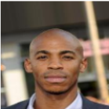

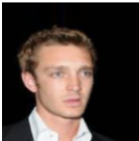

---

# ⚙️ 4. VQ-VAE Model

## 🔹 What is VQ-VAE?

A **Vector Quantized Variational Autoencoder** converts images into:

* Continuous latent → quantized → **discrete tokens**

---

## 🧩 Components

### 1. Encoder

* CNN-based architecture
* Uses:

    * Multi-scale convolutions
    * Skip connections
    * Squeeze-Excite blocks
* Output:

```
(128×128×3) → (16×16×1024) → flattened tokens (256 tokens)
```

---

### 2. Codebook (Core Idea)

* Learns **512 embeddings**
* Each latent vector → nearest embedding
* Produces discrete tokens:

```
Token space: [0 → 511]
```

---

### 3. Decoder

* Mirrors encoder using:
    * Transposed convolutions
* Reconstructs image from tokens

---

### 4. Discriminator (GAN Enhancement)

* Improves realism
* Helps reduce blur
* Works with adversarial loss

---

# 📉 5. Loss Functions

Training uses a **hybrid loss**:

### Reconstruction Loss

* L1 loss (pixel accuracy)
* SSIM (structure preservation)

### Edge Loss

* Uses **Sobel edges**
* Preserves fine details

### Codebook Loss

* Aligns encoder outputs with embeddings

### Commitment Loss

* Forces encoder stability

### Adversarial Loss

* Improves visual realism

---

# 📈 6. Training Strategy

* Progressive GAN-style training
* Gradually increases adversarial weight
* Random discriminator updates (to stabilize training)

Here’s your updated section with the **codebook reset technique** cleanly integrated 👇

---

# 📈 6. Training Strategy

* Progressive GAN-style training
* Gradually increases adversarial weight
* Random discriminator updates (to stabilize training)

### 🔁 Codebook Reset Strategy (Dead Code Handling)

One critical challenge in **VQ-VAE** is *codebook collapse*, where some embeddings are never used (“dead codes”).

To solve this, we implement a **dynamic codebook reset mechanism**:

* Each embedding tracks its **usage frequency**
* If a code is rarely used (below a threshold), it is considered **dead**
* Dead codes are **reinitialized using real encoder outputs**

#### ✅ How it works:

1. During training, we maintain a **usage counter** for each code
2. Every *N epochs*:

   * Identify unused / low-usage embeddings
   * Replace them with **random encoder vectors from real images**
3. Reset usage counters to allow fair reuse

#### 🎯 Why this matters:

* Prevents wasted embedding capacity
* Improves representation diversity
* Stabilizes training
* Increases effective codebook utilization

#### 🧠 Intuition:

Instead of letting parts of the latent space “die”, we **recycle them using real data**, keeping the model expressive and efficient.


---

### 🖼️ Reconstruction Results

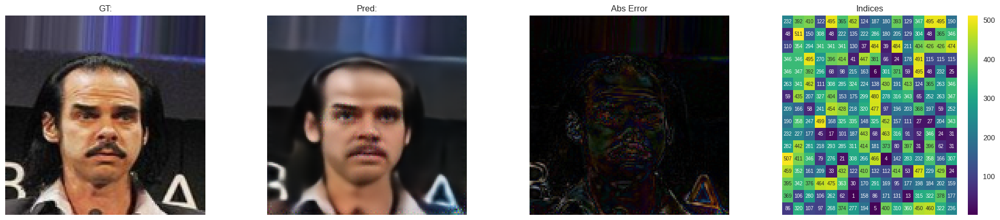
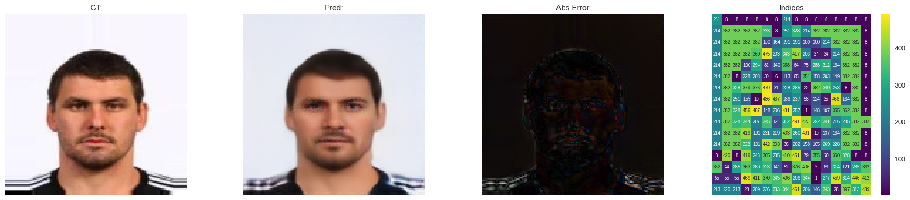
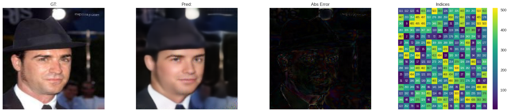
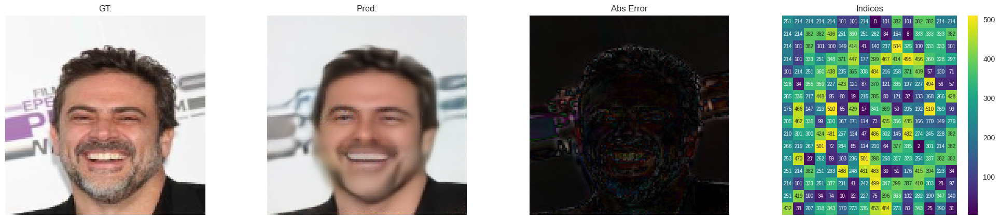
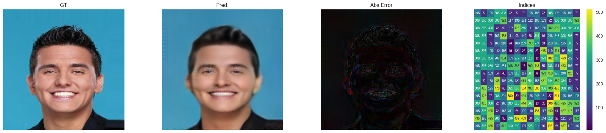
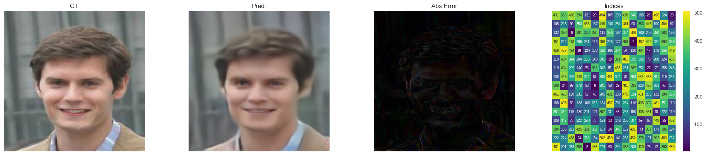

---

### 🧠 Codebook Visualization

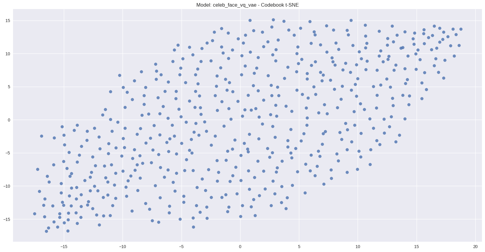

---

# 📦 7. Deployment (ONNX)

After training:

* Encoder → ONNX
* Decoder → ONNX
* Codebook → CSV

This allows:

* Fast inference
* Cross-platform deployment

---

# 🔁 8. Encoding Dataset into Tokens

Each image is converted into:

```
256 discrete tokens
```

Plus facial attributes → text tokens

Example:

```
<START_FACE> <MALE> <SMILING> <NO_GLASSES> ...
<START_GENERATION>
<CODE_123> <CODE_045> ... (256 tokens)
<END_GENERATION>
```

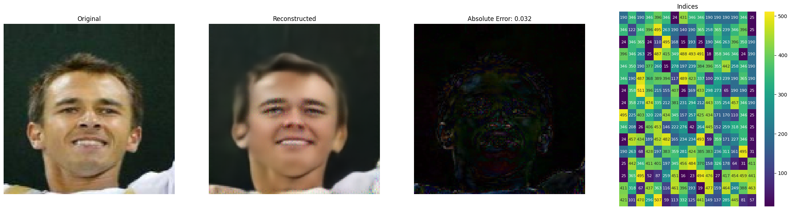
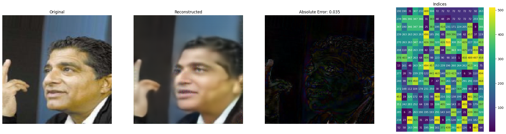
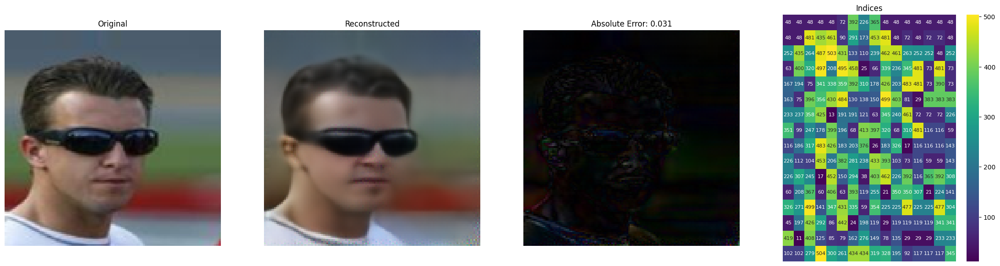

---

# 🤖 9. GPT-2 Training

## 🔹 Idea

Treat face generation as a **language modeling problem**

---

## 🔤 Custom Tokenizer

Vocabulary includes:

* Special tokens:

    * `<START_FACE>`
    * `<START_GENERATION>`
    * `<END_GENERATION>`
* Facial attributes
* Code tokens: `<CODE_000>` → `<CODE_511>`

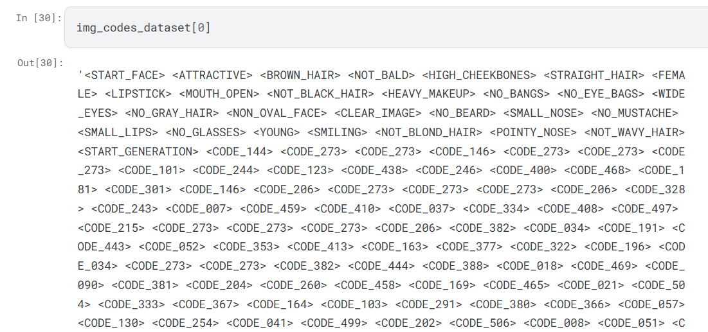

---

## 🧠 Model

* Base: GPT-2

---

## 📊 Training Setup

* Max length: 300 tokens
* FP16 training
* HuggingFace Trainer
* Evaluation per epoch

---

# 🎯 10. Face Generation

## Input:

Random or chosen face attributes:

```
<MALE> <SMILING> <BLACK_HAIR> <NO_GLASSES>
```

## GPT-2 generates:

```
256 code tokens
```

## Then:

```
Codes → embeddings → decoder → image
```

---

### 🖼️ Generated Faces

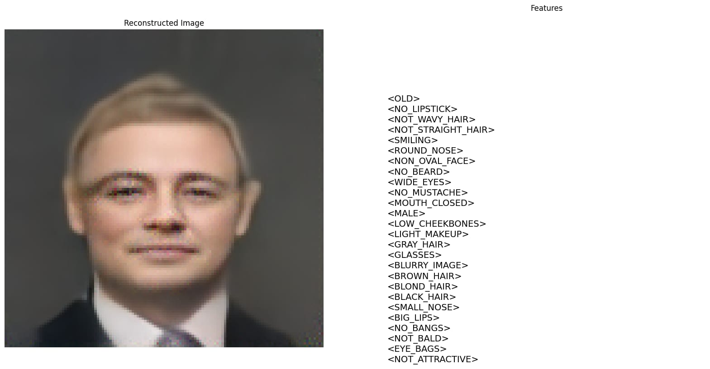
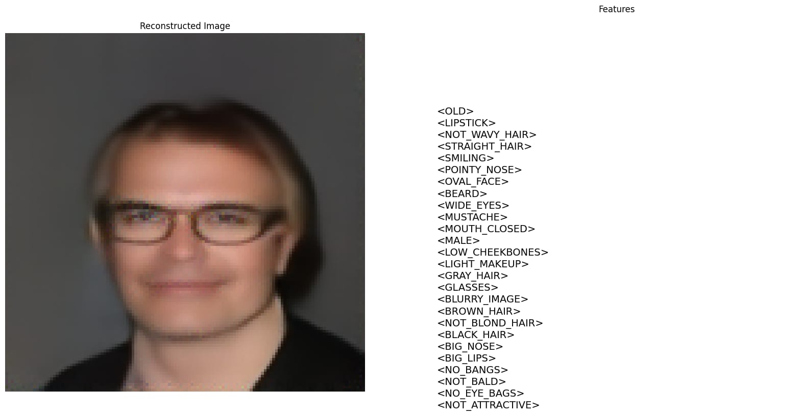
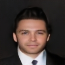
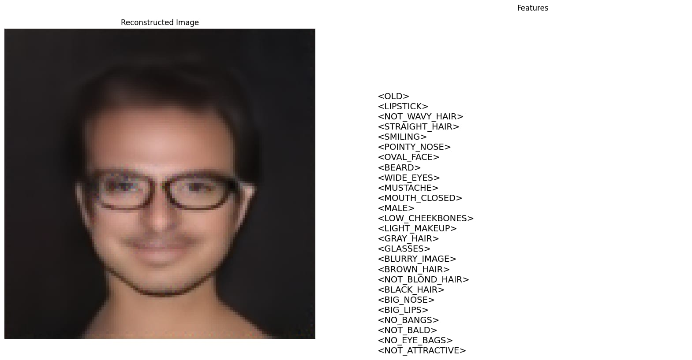

---

# 🚀 11. Inference Pipeline

1. Generate tokens using GPT-2
2. Fix missing tokens (if needed)
3. Convert tokens → embeddings
4. Decode into image

---

# 🌐 12. Live Demo

Try it yourself:

👉 [https://apppy-spavstukx76ynrmdkxruhy.streamlit.app/](https://apppy-spavstukx76ynrmdkxruhy.streamlit.app/)

---

# 🤗 13. HuggingFace Model

👉 [https://huggingface.co/yosef-samy019/gpt-face-celeb-generator](https://huggingface.co/yosef-samy019/gpt-face-celeb-generator)

Includes:

* GPT-2 weights
* Tokenizer

---

# ⚡ 14. Key Innovations

* 🔥 Treating images as **language tokens**
* 🔥 Combining **VQ-VAE + GPT-2**
* 🔥 Attribute-controlled generation
* 🔥 Lightweight vs diffusion models

---

# ⚠️ 15. Limitations

* Faces may lack high realism vs diffusion models
* Token prediction errors propagate
* Fixed latent size (256 tokens)

---

# 🧠 16. Future Work

* Use larger transformers (GPT-Neo / LLaMA)
* Better codebook utilization
* Hierarchical tokens
* Combine with diffusion refinement

---